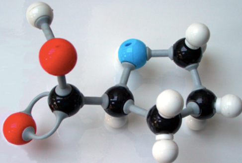

```{r setup,include=FALSE}

library(ggplot2)

```

## INTRODUCCIÓN
Las moléculas, como aquellas que componen tu cuerpo, son solo colecciones de átomos que están unidos por enlaces químicos.

<center>{width=400}</center>


## REACCIONES QUÍMICAS
Las reacciones químicas suceden cuando se rompen o se forman enlaces químicos entre los átomos. Las sustancias que participan en una reacción química se conocen como los reactivos, y las sustancias que se producen al final de la reacción se conocen como los productos


$$
\left.\left.2 \mathrm{H}_{2} \mathrm{O}_{2} \text { (peróxido de hidrógeno }\right) \rightarrow 2 \mathrm{H}_{2} \mathrm{O}(\text { agua })+\mathrm{O}_{2} \text { (oxígeno }\right)
$$


<center><iframe width="560" height="315" src="https://www.youtube.com/embed/KZmVvOxAXBU" title="YouTube video player" frameborder="0" allow="accelerometer; autoplay; clipboard-write; encrypted-media; gyroscope; picture-in-picture" allowfullscreen data-external=1></iframe></center>


## TIPOS DE REACCIONES

<ol>
<h1><li>Reacciones de precipitación</li></h1>

Cuando dos soluciones se mezclan y se forma una sustancia sólida que no se disuelve estamos en presencia de una reacción de precipitación.

Ejemplo:

$$
\mathrm{AgNO}_{3(1)}+\mathrm{KCl}_{(1)} \rightarrow \mathrm{AgCl}_{\text {(sólido blanco) }}+\mathrm{KNO}_{3(1)}
$$


<h1><li>Reacciones ácido-base o de neutralización</li></h1>
Un ácido es una sustancia que aumenta la concentración de iones hidrógeno (H+) en una solución cuando se disocia alguno de sus átomos de hidrógeno.

Ejemplo:

$$
\mathrm{H}_{2} \mathrm{SO}_{4(\mathrm{ac})}+2 \mathrm{NaOH}_{(\mathrm{ac})} \rightarrow \mathrm{Na}_{2} \mathrm{SO}_{4(\mathrm{ac})}+2 \mathrm{H}_{2} \mathrm{O}_{(\mathrm{l})}
$$

<h1><li>Reacciones de óxido-reducción</li></h1>
En las reacciones de óxido-reducción o también llamadas reacciones redox hay transferencia de electrones entre los reactantes. 

Ejemplo:

$$
\mathrm{H}_{2} \mathrm{~S}+\mathrm{Cl}_{2} \rightarrow 2 \mathrm{HCl}+\mathrm{S}
$$

<h1><li>Reacciones de combinación</li></h1>
Las reacciones de combinación involucran la unión de elementos o moléculas para formar un compuesto.

Ejemplo:

$$
A+B \rightarrow A B
$$

<h1><li>Reacciones de descomposición</li></h1>
En el caso de las reacciones de descomposición, un compuesto se divide en sus componentes.

Ejemplo:

$$
A B \rightarrow A+B
$$

## VELOCIDAD DE REACCIÓN
La velocidad de reacción se define como la cantidad de sustancia que se transforma en una determinada reacción por unidad de tiempo.

```{r ggplot2,fig.align='center',echo = FALSE}
qplot(x = dist, y = speed,data = cars, main = "Velocidad de reacción", ylab = "Concentración" ,xlab="Tiempo")
```

Para más información:


<center><iframe src="https://www.google.com/maps/embed?pb=!1m18!1m12!1m3!1d3901.6590136745167!2d-77.03968228523888!3d-12.066966191453782!2m3!1f0!2f0!3f0!3m2!1i1024!2i768!4f13.1!3m3!1m2!1s0x9105c9035fc2989b%3A0x5bc2b45cb5f18721!2sColegio%20de%20Qu%C3%ADmicos%20del%20Per%C3%BA!5e0!3m2!1ses-419!2spe!4v1659846542650!5m2!1ses-419!2spe" width="600" height="450" style="border:0;" allowfullscreen="" loading="lazy" referrerpolicy="no-referrer-when-downgrade" data-external=1></iframe></center>


</ol><div class="tocify-extend-page" data-unique="tocify-extend-page" style="height: 0;"></div>